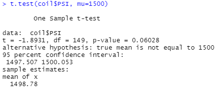

# MechaCar Statistical Analysis

## Linear Regression to Predict MPG

We performed a multiple linear regression on MPG data to determine which variables provide a non-random amount of variance in the MPG. 

Vehicle length (p=2.60e-12) and ground clearance (p=5.21e-8) have a significant impact on MPG, while spoiler angle (p=0.3069) and AWD (p=0.1852) contribute random amounts of variance and have an insignificant impact on MPG. Vehicle length (p=0.0776) is not as clear cut because it falls much closer to the 0.05 p-value significance threshold. 

Since the p-value for our model is 5.35e-11, there is significant evidence that we can reject the null hypothesis that the slope of the linear regression line is zero and conclude that there are several factors that provide non-random amounts of variance. While most the variables have a positive correlation with mph, AWD has a negative corelation. However, since AWD is a catergorical variable we should either exclude it from the linear regression model, or incorporate it by creating two subsets of data and running separate regressions for each category.

The r-squared value for our linear regression is 0.7149, meaning about 71% of the variation in the data can be explained by our model.  While our model is moderately reliable, we could likely increase our r-value by as adding more variables. 

## Summary Statistics on Suspension Coils

The variance of the suspension coils must not exceed 100psi, per manufacturer's specifications. The summary data for all the coils produced (n=150) shows a variance of 62.3psi, within the specifications.

However, when you group the coils by manufacturing lots (each n=50) there is more variance:

While Lot 1 and Lot 2 have very little variance, Lot 3 has a variance of 170.3psi which is much higher than the acceptable threshold. Further investigation is needed in order to determine whether this data is an anomally or if there is a manufacturing issue that is causing the variance that needs to be addressed. 

## T-Tests on Suspension Coils

The t-test results for all the samples gave us a p-value of 0.06072, falling just short of statistical significance.

The t-test results for the three Manufacturing Lots gave us the follwing p-values:
- Lot 1: p = 1
- Lot 2: p = 0.6072
- Lot 3: p = 0.0417

While Lot 1 and Lot 2 have p-values great enough that we fail to reject the null hypothesis that the true mean is 1500psi. However, Lot 3 has a p-value that falls below the 0.05 significance threshold, leading us to reject the null hypothesis that the true mean is 1500psi. Since the results for Lot 3 are statistically significant we would advise examining the manufacturing process to determine what is causing these results.  

## Study Design: MechaCar vs Competition